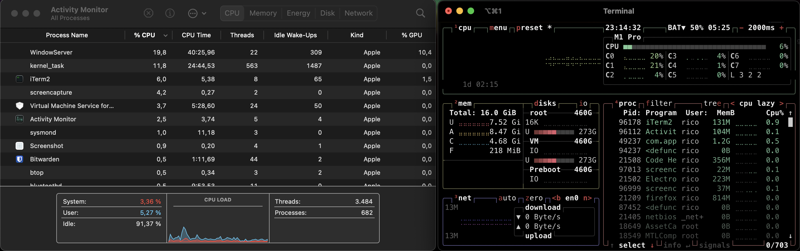
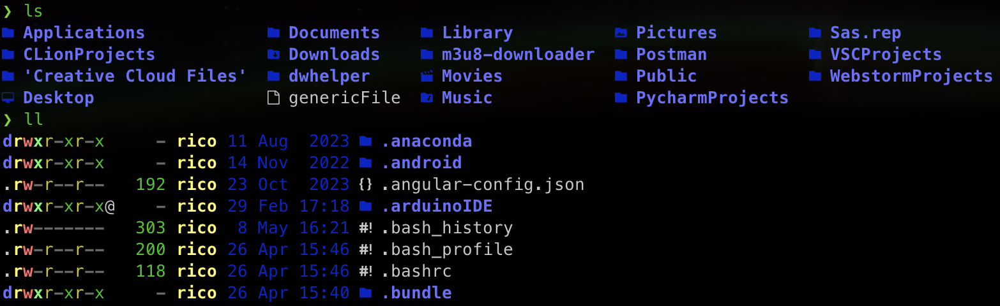
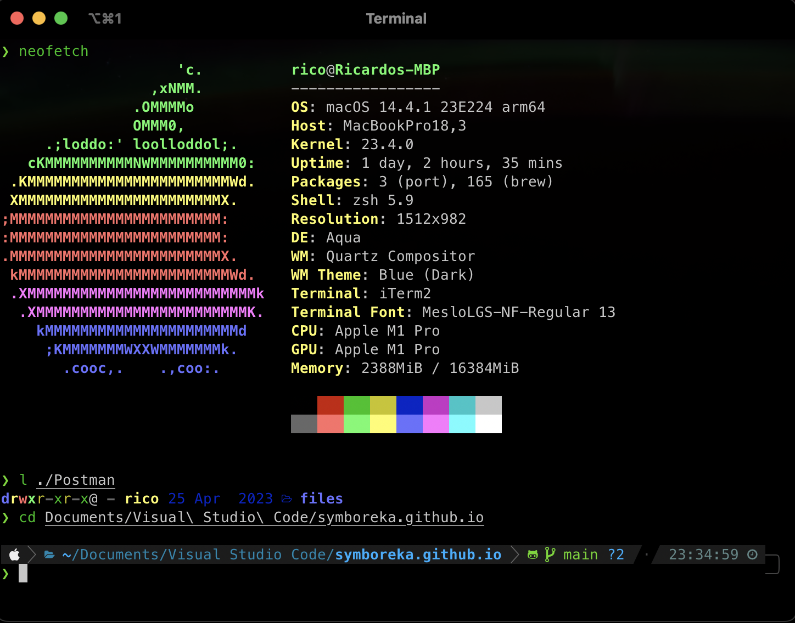

## Introduction

So I was introduced to a whole new world, the world of terminal customization. Ricing is what people call it.
It is quite a rabbit hole to dig into, however I wanted to scratch the surface a little and see how I could make my Mac Terminal experience a little better.

In this article we will go into the following tools and programs:
- iTerm2
- Powerlevel10k
- Zsh-Plugins
- Eza

## Prerequisites

You need
- a MacOS system with [Homebrew](https://brew.sh/) installed.
- git installed. Run `git --version` in your terminal to check if it's installed

## The first thing to do - iTerm2

Now lets get some new stuff on our system. The built-in Terminal.app in MacOS is fine, but lacks some features that I want to use.
The moment I realized that MacOS's Terminal doesn't even support 256 Colors (despite the $TERM variable saying so) was a shock to me.

I figured this out by trying to use `btop`. This is an upgraded version of the command `htop`, which initself is an upgraded version of `top`, which itself is the Linux way of checking your processes, their cpu usage,... (like Task Manager in Windows or Activity Monitor in MacOS)



So lets fix this by installing a new Terminal Emulator.
[iTerm2](https://iterm2.com/) is a famous Terminal Emulator that most MacOS Pro's use instead of the built-in one. To install it run `brew install --cask iterm2` in your old and rusty terminal. (Alternatively you can go to [iTerm2's website](https://iterm2.com/) and download the .app and move it to your Applications folder)

Now that iTerm2 is installed, make it your default Terminal Emulator by opening it, then clicking iTerm2 on the top right of your screen, then one of the later options should say "`make iTerm2 default Term`".

Great! Now we have the basis for some crazy customization and just overall a better set of features without sacrificing any drawback from the functionality of the old Terminal.

## Terminal Customization - Powerlevel10k

Now lets get into some fancy tools. This one is called Powerlevel10k and is a guided configuration on how you can customize your shell the way you prefer. To install this, run `brew install powerlevel10k` in your iTerm2. (From now on, all references to a Terminal will mean iTerm2)

Now that Powerlevel10k is installed, we can start customizing it!
Run `p10k configure` in your Terminal. This will be a guided walkthrough of the most basic customizations you can do with this tool. There is plenty more, but those are for another day. In order to apply the changes you can either restart iTerm2, or run `source ./zshrc`. 

> Note: If you want to use your new Terminal in VSC, add `MesloLGS NF` as your font in VSC, so it can display all the characters.

The result of your configuration is stored in the `.p10k.zsh` file. Back this one up if you want to reload your settings without going through the wizard again.

Configure your Terminal to your liking and enjoy!

## Adding more functionality - zsh Plugins

Now that we are here, we can make our terminal experience much better. By adding Plugins to our shell (zsh is the default with MacOS), we can enhance what the shell does for us. Here, I will present two plugins that I use.

### zsh-autosuggestions
This program will go through your command history as you type, so it will suggest commands you've recently used. Autocomplete them using the right arrow key. To install this, run `brew install zsh-autosuggestions`.
Now all we need to do, is to make this program run everytime we start a shell. We do that by appending a String to our shell. Simply run this command, which will append the necessary string to your `.zshrc'. 
```sh
echo "source /opt/homebrew/share/zsh-autosuggestions/zsh-autosuggestions.zsh" >> ~/.zshrc
```

### zsh-syntax-highlighting
This Plugin does exactly what it says on the box. It will simply make navigating your Terminal more colorful and slightly better readable. In order to install it, we'll use brew once again: `brew install zsh-syntax-highlighting`. After it's installed, make sure that it will be executed as we run a terminal like it was in the first plugin, this time using 
```sh
echo "source /opt/homebrew/share/zsh-syntax-highlighting/zsh-syntax-highlighting.zsh" >> ~/.zshrc`
```

> As a side note, yes you can use oh-my-zsh as a helper tool to configure zsh. It may be the preferred route, its simply not the route I went for. Maybe I'll change this in the future.

## ls is dead. Long live ls!

If you are using your Terminal from time to time, you've surely used `ls` already. On most Raspberry Pi's, this command is aliased with `alias ls="ls --color=auto"`. Thats why the entries on your RPI look so colorful, while they are bland and grey on your mac.

We could either add that same alias to our `.zshrc` and make it colorful too, or we could level up our ls-experience to new heights.



What you are seeing here is a program called [`eza`](https://github.com/eza-community/eza). It aims to do everything that `ls` does, but better. Installing it is easy with `brew install eza`.

> Note: Eza is the new and further maintained version of exa. It's recommended to use eza instead of exa. There was some drama about it, not really worth going into.

Now that it's installed, you will see that your system does not use eza by default. Thats because eza will leave your system itself alone. Only when specifically calling eza, it will run. Thats why we use our `.zshrc` yet again to create several aliases that will create the output we desire. As most programs in Linux, eza is highly customizable. I recommend checking their featureset on their [website](https://github.com/eza-community/eza).

Here are all the aliasses that I used, feel free to add them to your `.zhsrc.


`alias ls="eza --icons"` : This will make `ls` run eza instead, also adding nice icons to every file.<br>
`alias ll="ls -la"` : Default alias to make your life easier<br>
`alias l="ls -la"` : Yes, you may call me lazy with this one.


## Miscellaneous additions

Some neat settings are placed within the Settings of iTerm2. You can access them by using `CMD + ,`. Here is a short list of things I adjusted:
- Transparency: Profiles -> Window -> Transparency -> 10%. This will change the Terminal's transparency. I like to see just a little bit of my background.

- .hushlogin: Do you wish to not see the message "Last logged in at:..." Message at startup? simply create a `.hushlogin` file in your home directory. The mere existence of this file scares the message away.

- Window Name: In Settings -> Profile -> General you can adjust the naming structure of your terminal windows. As they do not change while using the terminal, i simply gave them a static name and removed all other options.

- Closing behaviour: General -> Closing: I have only the first two options checked, as I want my applications to actually quit, when I quit them, but be warned when I close multiple sessions (maybe unknowingly). 

- Arrangement: This one behaves a little differently. If you want your Terminal to start up with a certain position and size, you can do that. Simply move and resize the Terminal to your liking. Then on your top-row hit Window -> Save Window Arrangement. Now you can go to Settings -> General -> Startup. Change this setting to "Open Default Window Arrangement". Now this arrangement will start when you open iTerm2.


## Closing words

Now that I have been through this journey, I am very happy with the results. The total amount of time I spent informing myself about those programs (including writing this article) was around 5 hours. I'm sure that I will continue customizing and adding features to my setup, but this is the result of the first session and I'm glad I did it.

This project made me want to use my terminal even more in the future. Maybe I will make the step towards a customized nvim environment next. This rabbit hole will be an issue for another day though. For now I hope you enjoyed this read!

