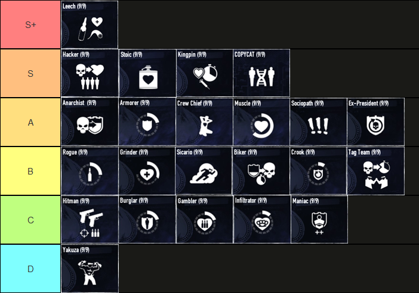

TODO:
- perk deck descriptions, go tierlist bottom up
- mod option descriptopn
- more mods from browser import
- spell check
## Introduction

This post was made due to the mods of my installation becoming very complex. This acts as my personal reference for mod options aswell as a guide for newer players for one of the possible paths to approach this game with a focus on modding.

## Adressing Payday 3
Despite the successor of Payday 2 being released, to this date I still prefer and recommend this installment.
This has several reasons, mainly that the gameplay loop of Payday 3 is currently less fun. This and the amount of Content in the third part is as of the writing of this post WAY less than the second.

Bugs and Reworks are released often which makes the game seem like a Beta still.

The good parts that I currently see in Payday 3 are:
- Better Graphics
- Better Stealth

The game is still in development despite the new devteam working on Payday 2 again, so lets see how Payday 3 will be in the future.
Until then, I will refuse to be an unpaid beta tester and wait until the public view of the game changes.

## Do you 'need' DLC?
### My opinion on DLC's
This game has a TON of DLC and can get very expensive. If you own only the base game, go ahead install and play it. You will see for yourself if you like this game or not.

Once you decided that you do like this game and want to go deeper, the **Legacy Edition** is what I would recommend.
It might go on Discount, check SteamDB's price history to anticipate the next sale and save some money.
With this edition you get all you need to play meta. While not unlocking the full game, you will get the most important DLC and everything to make you DSOD-Ready.

The **Infamous Collection** contains all DLC that are still purchaseable. Not necessary, if you are unsure yet, dont buy that. You will know when its time.

### My opinion on the Subscription Model
Late 2025 they revived Payday2 with a new subscription model. This, in my opinion, is a huge scam. Pay forever until you dont, then you own nothing. ONLY get this if you know you will only play for a short while and then never want to touch this game again.
Otherwise I would simply recommend that you buy the game normally and then treat it as if it was a subscription by buying a DLC every month or every second month. This costs a slight bit more upfront, but you keep that content forever (as long as steam supplies the files). 

Don't buy subscriptions to singular games, we don't need even more subscriptions that creep in our lives and slowly drain us of our money without giving us anything in ownership in return.

## In-Game Options
Here are the In-Game Options that are most important to newer players.

1. Texture Quality (Options -> Video)
> This game, due to its age, has many quirks. The most important one is that the game tends to crash. A lot. Since there are several memory leaks in this game and the game being a 32-bit client, running max textures will have your game crash faster. It is recommended to have your **Texture Quality** on Medium or lower. Also *Uncheck* **USE HQ WEAPONS** for the same reason.

2. FPS and Streaming Chunk (Options -> Video)
> Set your **MAX FPS** to whatever your PC can handle. Streaming Chunk should be on **4096** (highest value) always. All other settings will increase loading times for no good reason.

3. FOV
> The default FOV of this game is the definition of old-school-console-gaming. Go into any heist and change this slider to your liking, you will immediately feel relieved and likely put it at max.

4. Ammo Outline, Throwable outline. (Options -> Gameplay)
> This Setting enables you to see dropped ammo from enemies through walls. This is crucial to keep your ammo in-stock. Same with Throwable outline.

5. Motion Dot / Crosshair (Options -> Accessibility)
> This option enables a pseudo-crosshair. It was originally intended as a way to reduce motion sickness, but most people use it as a crosshair-dot. I recommend enabling this, or getting a crosshair mod (modding is shown later in this post).

6. Flashbang Color (Options -> Accessibility)
> This used to require a mod but is now in the base game (yay). This setting changes the color of your screen when you are flashed. Simply saves your eyes and prevents headaches. Right now I have this setting on dark-grey, but I might change it to black in the future.

7. Skip Intro Launch Option
> While not a setting, this is one that I use. If you want to skip the intro video that plays after starting the game automatically, ad this to your game options in steam Payday 2 -> Right Click -> Properties -> Launch Options: `skip_intro`.
## Approaches (Loud/Stealth)
In Payday 2 there are two main ways of playing the game, **Loud** and **Stealth**.

### Stealth
In **Stealth**, you are sneaking through the mission and stealing whatever it is without getting caught.
These are all the important factors to keep in Mind when playing Stealth:
- Silenced Weapons (or Melee)
- 4 Pagers (Guard Kills)
- Detection Risk (5 or below is perfect)

Quick Note, your **Footsteps** are silent. Dont worry about sprinting or jumping right behind a guard, they only have a cone of vision.
Also, going below 5% Detection Risk has no benefit, it is only visual. Detection always starts at 5%.

### Loud
This is my preferred way of playing the game. I like the sheer variety this mode offers with different guns, skillsets and perk decks.
While there is a single perfect stealth setup that offers all necessary tools, in Loud many playstyles and builds are viable on the highest difficulty.

In Loud, these are the important factors to keep in mind:
- Armor (your defense)
- Guns in conjunction with Skills (how you deal damage)
- Perk Deck (the mantra of how you play your build)
- Crew Management / Bots (super strong)

##### How Armor Works:
In the base variant with no skills etc, armor is the only regenerative shield you have. It is the white circle that surrounds your Health-Bar. Once it is depleted, you have to move into cover for some time until it recovers. Push only when armor is up, hide when its down.

In Payday 2, your Bots deal more damage than you in a lot of cases. Their loadout is super important for dealing damage while you focus on the objective. These are the best guns for them to choose (no weapon mods needed, the bots only take the base variant)
- Brenner LMG (for close range)
- Queens Wraith Rifle (all-purpose)
- Akhron LMG (currently bugged, it does 10x the intended damage. Might get patched in the future. Abuse if you want.)

##### On the topic of Meta:
While there is a "meta" and it is the most powerful way to go, you really dont have to and I would go as far as recommending to not go "meta". In this game, almost everything can be used to play on the highest difficulty. So choose the guns and perk decks as you like and see how far you can go before you use the internet on inspirations to your build.
> I used to play "meta only" decks for most of my payday-career and am now suffering because of it. I used to only be able to play with builds I stole from other people. This is technically all fun and fine, however I recently switched to doing my own research and testing (therefore also created this post as notes) and I rediscovered a lot of joy playing this game even 900+ hours in.

## Skills
This is a simple one, read through **all of them** eventually, at your own pace. No need to do that at the beginning, but you should definitely have this on your todo list.
 
## Perk Decks
Here are my key takeaways for each perk deck as far as I experienced them. My Interpretation might be completely wrong and are definitely biased to my personal opinion, so take this with a massive grain of salt.

For a slightly more objective sort, here is a Perk-Deck Tierlist provided by KevKild.

##### Loud or Stealth?
The following list with explanations is for Loud mostly. There are stealth specific perk decks, but my explanations will only focus on the loud aspects. For Stealth (mainly beginner-stealth), I recommend **Burglar** because of the Pager-Speed. Eventually you will use **Copycat** or **Hacker** in stealth, but they utilize to new mechanics. I recommend **Burglar** for learning the base game and eventually branching off.

### Beginner Perk-Decks
I will start out with some beginner perk decks. This means that you get really good benefits from the early stages of the deck, usually the first card. Some of those perk decks start to decline in power on higher difficulties, but by then you will have enough points to unlock other perk decks.

#### Gambler
Easiest starter deck
...
#### Biker
Middle-ground as a starter deck
...
#### Ex-President
Hardest of the starter decks
...

### Average Perk Decks
These perk-decks are either "mid-tier" perk decks, or decks i barely ever use. In the last section are the truly god-tier decks.

### God-Tier Decks
Here I will show the objectively best perk decks, as well as my personal favorites.

#### Leech
According to the Tierlist by KevKild, this is the best perk deck in the game.

#### Hacker
My research says, that this is the most used high tier perk deck.

#### Stoic
...

#### Kingpin
...

#### Copycat
This is a complicated one
...

#### Anarchist
One of my personal favourites but never played proper

## Profiles / Skill Sets
This game offers you many profiles where you can save your build, so you can experiment with different playstyles while preserving your progress on a different profile.

Here are my recommendations:
1. Have at least two profiles, one for loud, one for stealth.
2. Rename your Profiles to describe the playstyle. (For example, "loud", "stealth", or more exact, "sniper anarchist", "lmg stoic"...)
3. Rename your skillsets to the exact same name as the corresponding profile
4. never re-use one skillset for multiple profiles

## Mods 
Alright, here we go. Modding is a huge part of Payday and its Community.
Here I will provide a quick guide on how to install Mods in 2026 and onward.

### Opinion on "Cheaty Mods"
First things first, on the topic of "Cheaty Mods":
There are mods that completely break the balance of this game and change it fundamentally.
I personally dont use those overhauls, but you do you.
On the topic of **HUD's**, for some reason some people think that HUD's are cheaty.
They do provide more information than the vanilla game in most cases, however chances are high (>95%) if you meet some player who has played for a while, they will have a HUD Mod.

Personally, there is only one Mod that I use that I consider slightly cheaty, which is an asset swap for Keycards. Quintessence, I see keycards through walls. Wether this is a crime or not is for you to decide.

##### On the Topic of DLC Unlocker Mods:
I used to be of the type *never use those mods, just buy the DLC or don't play the content, on missions only the host has to own the DLC anyways* type of guy. This view has changed due to some recent updates. A lot of content is nowadays behind DLC-Walls that you literally **can not purchase** anymore. Due to this, unlocking those exact DLC is in my opinion fine. Apparently some people got the "Cheater-Tag" in Game due to this, this Tag does not mean that the player cheats, but that the user has pirated some DLC. Not all of the DLC Unlockers will give you that tag, but some do. Do your own research on how to prevent this, as I personally don't like playing with people with a cheater tag. I own all the gameplay-related DLC, so this is a non-issue for me.

### My Modlist
Here I will provide my complete Modlist as of the creation of this post. This may be changed or updated in the future. I broke them down into categories, as there are many nowadays.

#### Informational
- VanillaHUD Plus
- Better Assault Indicator
- CustomFOV_Fixed
- Endscreen XP List
- More Weapon Stats

#### Quality of Life Mods
- Anticrash
- Borderless Window Updated
- CrimeNet Cleanup
- Less Inaccurate Weapon Laser
- Load Steam Inventory Once
- Low Violence Mode
- Music JukeBox Control
- No Cloaker Camera Movement
- No Screen Shake (only on Shooting)
- Viewmodel Tweak

#### Fun Mods
- Radial Menu Vocalizer
- Any Day Any Heist
- RandomHeistButton

#### Assets (mod_overrides)
- Enemy Health and Info (included in VanillaHUD Plus)
- Keycard Highlight
- No Dirt Camera
- Silent Killer - Old model (No, this is not SilentAssassin)

### How to Install Mods
1. Open up your Payday Installation Folder (Steam, Rightclick Payday -> Properties -> Browse Local Files)
2. Download the SuperBLT file from [HERE](https://superblt.znix.xyz/)
3. Paste the `WSOCK32.dll` (SuperBLT) to the base folder of Payday2. (`.../Steam/steamapps/common/PAYDAY2/WSOCK32.dll`)
4. create a `mods` folder inside PAYDAY2 (`.../Steam/steamapps/common/PAYDAY2/mods/`)
5. create a `Maps` folder inside PAYDAY2 (`.../Steam/steamapps/common/PAYDAY2/Maps/`) (Yes, uppercase)
6. create a `mod_overrides` folder inside the PAYDAY2/assets folder (`.../Steam/steamapps/common/PAYDAY2/assets/mod_overrides/`)
7. Download BeardLib [HERE](https://modworkshop.net/mod/14924)
8. Extract the folder and paste the folder inside your mods folder. (`.../Steam/steamapps/common/PAYDAY2/mods/BeardLib/`)
9. Launch the Game and verify the installation by checking the Main Menu Mod Panel and update if necessary.
10. Download any mods you like and check their install instructions, the base setup for modding is complete.

##### Mod Sources:
- [Modworkshop](https://modworkshop.net/g/payday-2) (GoTo Source)
- [Pd2Mods](https://pd2mods.z77.fr/home.html) (Only if not found on Modworkshop)

### Recommended Mod-Path
Here I will present a recommendation for newer players on how to approach modding and what mods to get first. This will have decisions in mind, so if you feel like you want to take it slow, there will be notes on what to skip out on at first, so you won't get overwhelmed immediately.

Install them at your own pace, ideally one by one while playing heists inbetween. Check out their options under Options -> Mod Options.

1. SuperBLT and BeardLib 
> Required to start modding, part of the installation tutorial above

2. VanillaHUD Plus (Skip this one if you want to take it slow, it will reappear later) 
> This mod changes your whole UI, its a LOT to unpack and customize. Basic Settings are OK. This mod will give a ton of additional Information on screen.

3. The Fixes
> This Mod simply adresses developer oversights and some bugs. It even might make you crash less, its a no-brainer to have installed. Check the mod page for an "Outdated"-Tag, if this ever appears, this mod is no longer necessary. Until then, get it.

4. Anticrash
> Same as above, this mod catches situations where your game would have crashed and prevents the crash in many cases. Another no-brainer.

5. CustomFOV_Fixed
> This mod is optional. If you find the FOV Setting to be too limiting, here you can go to crazy high numbers. Otherwise skip this.

6. Less Inaccurate Weapon Laser
> This mod is from PD2Mods. Did you know the lasers you attach on guns are not accurate? Test it! This mod makes them more accurate.

7. Better Assault Indicator
> This mod changes the Assault-Banner in your loud heists. It will give you more information about the current spawns and timers when assaults start and end. Crucial on higher difficulties.

8. VanillaHud Plus (if you skipped this before, now is the time to get it)
> Notes from above

9. More Weapon Stats
> This mod shows many hidden stats for all guns in the game. This saves you from going to the Wiki every time you buy guns. It also shows damage breakpoints, which is amazing.

10. Low Violence Mode
> While I personally don't like gore in games, this is not the only reason to have this mod. This mod immediately removes enemies upon death so the game looks less cluttered. This also improves performance(!) and reduces the tendency to crash.

11. Music JokeBox Control
> Music is a huge part of Payday (for most people). This mod gives you full control over the songs in heists, you can change them mid-heist or disable them completely, including Allesso-Heist. It also has much more music from the Payday-Franchise than you would normally get in the vanilla game.

12. No Dirt Camera
> This game features a filter that puts static dirt on your screen, visible when shot, or when looking at a light-source. Test this by starting Go-Bank and looking at the sky. This mod removes this. This Mod is installed by putting it into the `mod_overrides` folder under `assets`. 

By now, you will have a decent understanding on what modding does and how it can significantly improve your gameplay. Feel free to get more mods from my Modlist above or from other sources.

### Mod Settings
Here I will present the changes I made to the Settings of my mods, as well as showing where to make changes when something bugs me.

To be written.

## References
- [Carrot: Literally EVERYTHING... Guide](https://www.youtube.com/watch?v=_SgDDP3EPdQ)
- [KevKild's Loud Guide on Steam](https://steamcommunity.com/sharedfiles/filedetails/?id=2269730558) 
- [The Long Guide](https://steamcommunity.com/sharedfiles/filedetails/?id=267214370) (Old, but REALLY really in-depth)
