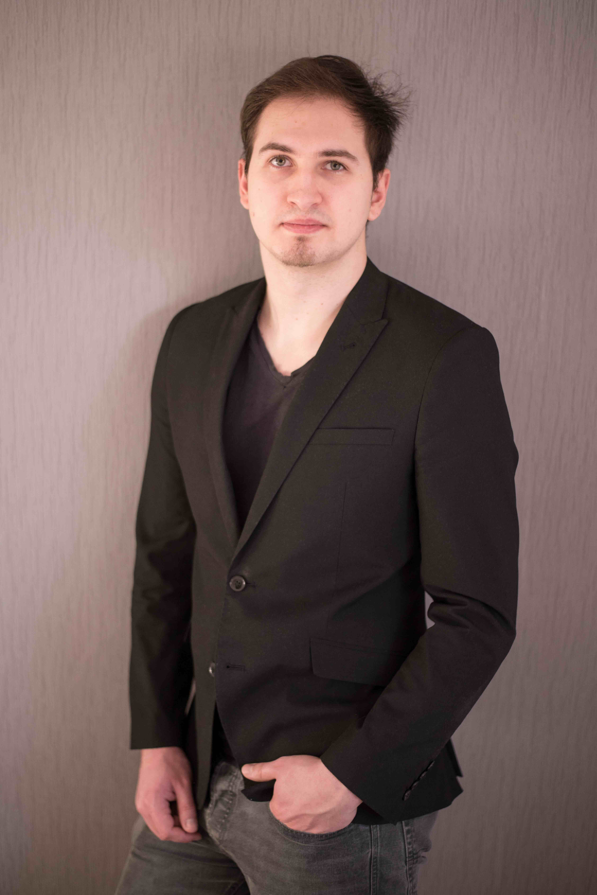

---
# the default layout is 'page'
icon: fas fa-info-circle
order: 4
---

Hi, I'm Ricardo Sendes, an IT-Student at the FH-Münster.

## Professional Summary
While studying I started teaching several subjects to other students. With currently over 4 years of experience teaching in subjects as technical fundamentals of computer science and programming in C++, I have developed a deep understanding of these areas and enjoy exchanging knowledge with others.

## Education and Learning
Im working on my Bachelor of Science degree in computer science from the FH-Münster. Currently, I am expanding my knowledge in hardware-oriented programming through courses, books and websites.
Some examples include "From Mathematics To Generic Programming" by Alexander A. Stephanov and Daniel E. Rose, and Websites like [Codewars](https://www.codewars.com/).

## Passions and Interests
Outside of work, I am passionate about Cycling and video games. I love spending my free time mountain biking or learning about the newest peripherals in the PC-world.

## Fun Facts
I used to have a twitch and youtube channel; most videos are unlisted, but still accessible via my discord server. I mainly streamed the game [Osu](https://osu.ppy.sh/).
Sometimes I still upload unlisted videos of funny moments that happen during gameplay.

## Let's Connect
Thank you for visiting my page. Feel free to connect with me on [LinkedIn](https://www.linkedin.com/in/ricardo-sendes-53a676222/).

---